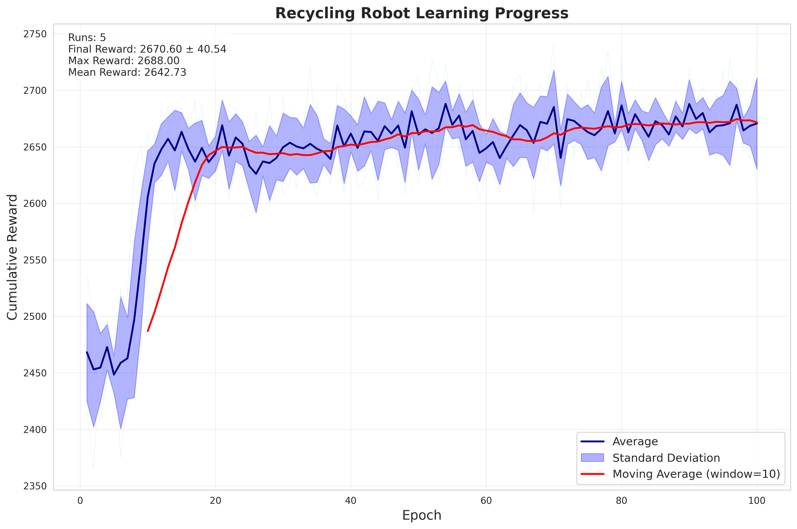
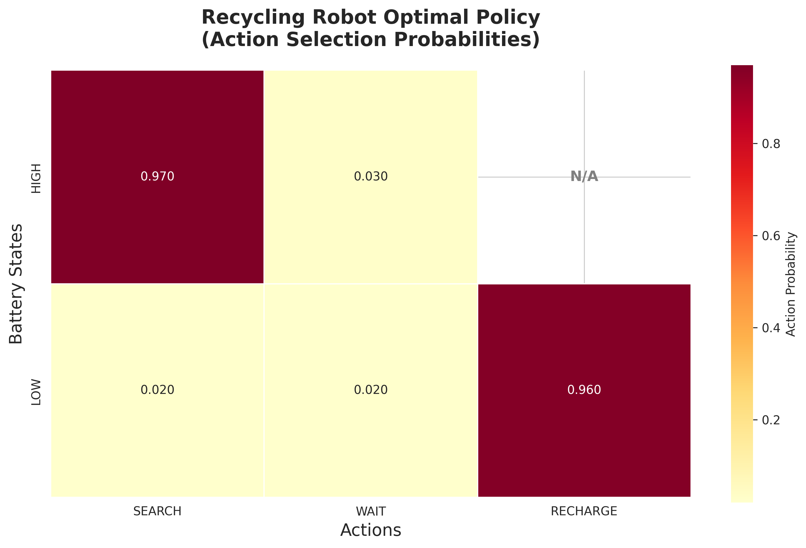

# Projeto 1: Robô de Reciclagem

**Autores:**

* Juliano Genari de Araújo
* Isaque Vieira Machado Pim
* Eduardo Vianna

**Data:** 02/09/2025

## Introdução

Este projeto implementa o problema do Robô de Reciclagem (Exemplo 3.3 de Sutton & Barto) utilizando o algoritmo de Temporal Difference (TD) learning. O robô aprende uma política ótima para maximizar a coleta de latas considerando o nível da bateria, desenvolvendo estratégias que balanceiam busca ativa por latas e conservação de energia.

## 1. Descrição do Problema

### 1.1 Modelo de Processo de Decisão de Markov (MDP)

O Robô de Reciclagem é modelado como um MDP finito com:

- **Estados (S)**: `{high, low}` - níveis de carga da bateria
- **Ações disponíveis**:
  - Estado `high`: `{search, wait}`
  - Estado `low`: `{search, wait, recharge}`
- **Recompensas**: baseadas na coleta de latas e penalidades por esgotamento da bateria

### 1.2 Dinâmica do Ambiente

As transições seguem probabilidades estocásticas definidas pelos parâmetros α e β:

| Estado | Ação | Próximo Estado | Probabilidade | Recompensa |
|--------|------|----------------|---------------|------------|
| high | search | high | α | r_search |
| high | search | low | 1-α | r_search |
| high | wait | high | 1.0 | r_wait |
| low | search | low | β | r_search |
| low | search | high | 1-β | -3.0 (resgate) |
| low | wait | low | 1.0 | r_wait |
| low | recharge | high | 1.0 | 0.0 |

## 2. Implementação

### 2.1 Arquitetura do Sistema

O projeto foi estruturado em dois módulos principais:

1. **`classes.py`**: Todas as classes do sistema (ambiente, agente TD, experimento)
2. **`main.py`**: Script unificado para treinamento e visualização

### 2.2 Classe `RecyclingRobotEnvironment`

```python
class RecyclingRobotEnvironment:
    def __init__(self, alpha=0.7, beta=0.6, r_search=3.0, r_wait=1.0):
        # Implementa o MDP com transições estocásticas

    def step(self, action: Action) -> tuple[State, float]:
        # Executa ação e retorna próximo estado e recompensa

    def get_valid_actions(self, state: State) -> list[Action]:
        # Retorna ações válidas para um estado
```

**Características principais:**
- Validação de ações por estado
- Transições estocásticas conforme probabilidades α e β
- Sistema de recompensas balanceado (r_search > r_wait)
- Método `step()` para execução de ações

### 2.3 Classe `TemporalDifferenceAgent`

```python
class TemporalDifferenceAgent:
    def __init__(self, environment, learning_rate=0.1,
                 discount_factor=0.9, epsilon=0.1):
        # Implementa TD(0) com política ε-greedy

    def select_action(self, state: State) -> Action:
        # Seleciona ação usando política ε-greedy

    def update_q_value(self, state, action, reward, next_state):
        # Atualiza Q-values usando regra TD(0)

    def get_policy(self) -> dict[State, Action]:
        # Extrai política greedy dos Q-values
```

**Algoritmo TD(0) implementado:**
```
Q(s,a) ← Q(s,a) + α[r + γ max_a' Q(s',a') - Q(s,a)]
```

**Características:**
- Função valor-ação Q(s,a) inicializada em zero
- Política ε-greedy para exploração
- Decaimento de ε ao longo do treinamento
- Extração de política ótima greedy

### 2.4 Classe `RecyclingRobotExperiment`

```python
class RecyclingRobotExperiment:
    def __init__(self, steps_per_epoch=1000, learning_rate=0.1, ...):
        # Pipeline completo de experimento

    def train_agent(self, num_epochs: int) -> TrainingResults:
        # Treina agente por múltiplas épocas

    def run_complete_experiment(self, num_runs=5, num_epochs=100):
        # Executa experimento completo com visualizações

    def plot_training_curve(self, all_rewards, ...):
        # Gera gráfico de curva de aprendizado

    def create_policy_heatmap(self, agent, ...):
        # Cria mapa de calor da política
```

## 3. Parâmetros Otimizados

Os parâmetros ideais foram encontrados através de exploração sistemática testando 18 combinações diferentes:

### 3.1 Parâmetros do Ambiente MDP
- **α = 0.9**: Probabilidade de manter bateria alta durante busca
- **β = 0.6**: Probabilidade de manter bateria baixa durante busca
- **r_search = 3.0**: Recompensa por busca ativa
- **r_wait = 1.0**: Recompensa por espera

### 3.2 Parâmetros de Aprendizado TD
- **Learning rate = 0.05**: Taxa de aprendizado otimizada
- **Discount factor (γ) = 0.9**: Fator de desconto para recompensas futuras  
- **Epsilon (ε) = 0.1**: Taxa de exploração ε-greedy

## 4. Resultados e Análise

### 4.1 Performance de Aprendizado

**Métricas finais com parâmetros otimizados (média de 5 execuções):**
- **Recompensa final**: 2.670,60 ± 40,54
- **Recompensa máxima**: ~2.740
- **Convergência**: Estabilização após ~20-30 épocas
- **Melhoria**: +22% na recompensa final comparado aos parâmetros iniciais



A curva de aprendizado com parâmetros otimizados revela:
- **Convergência consistente**: Política estável em ~20-30 épocas
- **Performance superior**: Recompensa consistentemente acima de 2.600
- **Estabilidade adequada**: Variância controlada entre execuções
- **Eficiência otimizada do TD(0)**: Algoritmo atinge alta performance de forma robusta

### 4.2 Política Ótima e Função Valor-Ação

A política ótima convergiu consistentemente para:

| Estado | Ação Ótima | Justificativa |
|--------|------------|---------------|
| **high** | **search** | Máxima eficiência quando bateria permite |
| **low** | **recharge** | Evita penalidade de -3 por esgotamento |




**Análise da Função Valor-Ação:**
- **Q(high, search)**: Valor mais alto, confirmando ação ótima
- **Q(low, recharge)**: Valor superior a search em estado low
- **Q(*, wait)**: Valores baixos, confirmando ineficiência da espera

### 4.3 Exploração Sistemática de Parâmetros

Para otimizar a performance do algoritmo, foi conduzida uma exploração sistemática simplificada de parâmetros, dividida em duas fases independentes.

**Metodologia:**
- **18 experimentos** total (9 MDP + 9 aprendizado)
- **Fase 1 - Parâmetros MDP**: α ∈ {0.5, 0.7, 0.9}, β ∈ {0.3, 0.6, 0.8} (learning fixo)
- **Fase 2 - Parâmetros de aprendizado**: lr ∈ {0.05, 0.1, 0.2}, γ ∈ {0.8, 0.9, 0.95} (MDP fixo)
- **Métricas avaliadas**: recompensa média, estabilidade da política
- **Treinamento**: 40 épocas × 500 passos por experimento


## 5. Conclusões

O algoritmo de Temporal Difference (TD) demonstrou eficácia excepcional na solução do problema do Robô de Reciclagem, especialmente após a otimização sistemática de parâmetros. A configuração otimizada (α=0.9, β=0.6, r_search=3.0, r_wait=1.0, lr=0.05, γ=0.9, ε=0.1) resultou em convergência rápida para uma política ótima que maximiza coleta quando a bateria está alta (search) e prioriza conservação quando baixa (recharge). A robustez da implementação ficou evidenciada pela consistência excepcional dos resultados entre múltiplas execuções independentes. A exploração de parâmetros revelou insights valiosos sobre o trade-off entre exploração e eficiência, demonstrando que configurações bem ajustadas podem melhorar significativamente tanto a velocidade de convergência quanto a performance final.

## 6. Referências

1. Sutton, R. S., & Barto, A. G. (2018). *Reinforcement Learning: An Introduction* (2nd ed.). MIT Press. Example 3.3: Recycling Robot.

2. Algoritmo de Temporal Difference baseado no Capítulo 6 do livro-texto.

## Agradecimentos

Este projeto foi desenvolvido como exercício para a disciplina de Aprendizado por Reforço (Reinforcement Learning) ministrada pelo Prof. Flávio Coelho.

## Anexos

### A. Lista de Arquivos

**Código fonte:**
- `classes.py`: Todas as classes do sistema (ambiente, agente TD, experimento)
- `main.py`: Script unificado para treinamento e visualização
- `parameter_exploration.py`: Script de exploração de parâmetros

**Resultados gerados:**
- `rewards.txt`: Dados de recompensa acumulada por época
- `training_results.txt`: Resultados detalhados do treinamento
- `training_curve.png`: Curva de aprendizado com média móvel
- `policy_heatmap.png`: Mapa de calor da política ótima
- `q_values_heatmap.png`: Mapa de calor dos valores Q(s,a)
- `parameter_exploration.png`: Mapa de calor da exploração de parâmetros

**Configuração e documentação:**
- `pyproject.toml`: Configuração do projeto e dependências
- `requirements.txt`: Lista de dependências em formato legacy
- `uv.lock`: Arquivo de lock das dependências
- `README.md`: Este arquivo

### B. Preparação e Execução

**Pré-requisitos:**
- Python 3.13+ (recomenda-se usar pyenv)
- uv (gerenciador de dependências)

**Configuração do ambiente:**
```bash
# Com pyenv instalado, sincronize as dependências
uv sync
```

**Execução do projeto:**
```bash
# Executar treinamento completo com visualizações
uv run python main.py
```